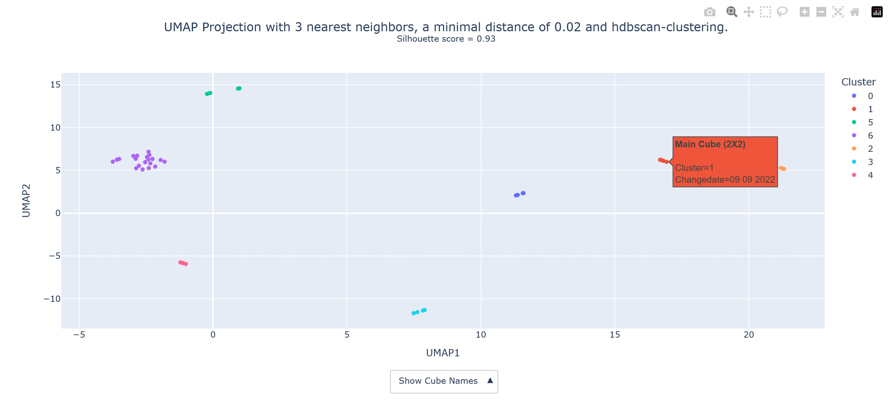
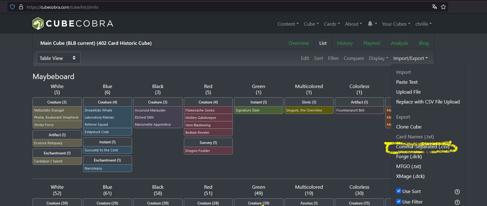

# [PCA CubeMap](https://github.com/fescofesco/PCA-CubeMap)

This project demonstrates dimensional reduction using PCA (Principal Component Analysis) and UMAP (Uniform Manifold Approximation and Projection) to cluster sets of Magic: The Gathering cards. It includes scripts for fetching cube data, processing it, and performing clustering analysis like described in the article from [luckypaper](https://luckypaper.co/articles/mapping-the-magic-landscape/).
The clustering can be evaluated using the [Silhouette score](https://en.wikipedia.org/wiki/Silhouette_(clustering)).

A sample file can be seen here:


The interactive version of this file can be accessed [here](https://github.com/fescofesco/PCA-CubeMap/blob/main/Readme_JPGs/umap_3n_neighbours_mindist0.02_hdbscan.html)


## Project Structure

```
PCA CubeMap
│
├── src\
│   ├── __init__.py
│   ├── import_cube_from_url.py
│   ├── main.py
│   └── PCA_clustering.py    
│
├── Input\
│   └── Cubedata\
│       ├── fetch_cubedata.txt
│       └── Cubedata\
│           ├── cubename.csv
│           └── cubename_cardnames.txt        
│
├── Output\
│   ├── Best Results
│   └── All Results
│
├── Readme_JPGS\
│   ├── Best Results
│   └── All Results
│
├── requirements.txt
├── .gitignore
└── Readme.md
```

## Scripts

### 1. `main.py`

This script serves as the entry point for the project. It orchestrates the workflow by calling the data fetching and clustering scripts.

#### Features
- Initializes the data fetching process.
- Loads and preprocesses the data for clustering analysis.
- Calls clustering methods and saves the results for visualization.

#### Usage

To run the main application, execute:

```bash
python main.py
```

This will fetch cube data, process it, and initiate clustering.

### 2. `import_cube_from_url.py`

This script fetches cube data from specified URLs, processes the data, and saves the card names along with the date of the latest change in CSV format.

#### Features
- Reads URLs from a text file and constructs API URLs to fetch cube data.
- Downloads cube data in JSON format and saves it for further analysis.
- Processes the downloaded data to extract card names and timestamps of the latest changes.
- Saves the extracted data into CSV files.

#### Usage


##### Setup the cubes you want to compare

First, you need to download the cube contents as a .csv to the direction
Input csv.

* This is done by writing the links to the cubes into the `.\PCA CubeMap\Inputs\fetch_cubedata.txt` file.
[Input / fetch_cubedata.txt](Input/fetch_cubedata.txt)


* Or do it manually with the export list command from cubecobra `C:\Users\felix\Documents\PCA CubeMap\Input_CSV`
 Therefore, click on the cube's you want to compare and export the list as *Comma-separated (.csv)*


Then start the main.py function in src / main.py

To run the script and fetch data:

```bash
python import_cube_from_url.py
```

Ensure that the `fetch_cubedata.txt` file is populated with the CubeCobra URLs before executing.


### 3. `PCA_clustering.py`

This script implements PCA for dimensionality reduction and applies clustering algorithms such as KMeans and Agglomerative Clustering to analyze the card data.

#### Features
- Performs PCA on the dataset to reduce dimensions.
- Applies various clustering methods and evaluates their effectiveness.
- Saves clustering results and visualizations.

#### Usage

To perform PCA and clustering analysis, run:

```bash
python PCA_clustering.py
```

This will process the data, perform clustering, and save the results.

## Requirements

- Python 3.7 or later
- `requests` library
- `pandas` library
- `scikit-learn` library
- `matplotlib` library
- `seaborn` library
- `plotly` library

You can install the required libraries using pip:

```bash
pip install requirements.txt
```

## Output

- The script outputs various files in the `Output/` directory, including:
  - CSV files containing the processed card data.
  - Visualizations of clustering results in HTML .
  - Any best results from clustering methods in `Output/Best Results`, all other visualisations are in `Output/All Results`.

## Author

This project was created by fescofesco in 2024.

## License

This project is licensed under the MIT License - see the [LICENSE](LICENSE) file for details.
